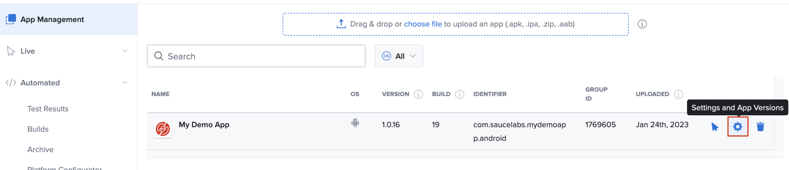

# Real Devices on Sauce Labs
{{ #include ../shared/appium-header.md }}

### Sauce: App Settings
Check your app's [Default Settings](https://docs.saucelabs.com/mobile-apps/live-testing/live-mobile-app-testing/#default-app-settings) like Device Language from the Settings page. 

>To view or change the app settings, on the App Management page, hover over the app and then click Settings.
> 
>These are GLOBAL for all users who can see this app.

Changing the Language Dropdown influences the LOCALE of your app. How your app handles a changing locale is going to depend on the app itself most of the time. This could involve third party code for specific workflows like payments or translating timezones. You may have some [i18n](https://en.wikipedia.org/wiki/Internationalization_and_localization) package that tries to switch to translated versions of the app.

### Appium
#### iOS 
Its important to be aware of what the Appium server can and can't do. For example [`appium:locale`](https://appium.github.io/appium-xcuitest-driver/4.16/capabilities/) is specifically for Simulators _"If a test is executed on a Simulator then UI locale is changed as well. You can also change Simulator locale in runtime using mobile: configureLocalization extension."_ If you're testing on Real Devices exclusively or with Espresso/XCUI tests you won't have access to that Appium Capability. 

#### Android
Contradictory to the iOS example Android can use Appium 2.0 to test Locale/Language. Consult the documentation <https://github.com/appium/appium-uiautomator2-driver#app-localization>. In this case the 

## Android
{{ #include ../shared/android-header.md}}

You CAN test with Appium + Real Devices. But you can also rely on the Language dropdown found in the App Settings. 

## iOS
{{ #include ../shared/ios-header.md}}

Rely on the [Sauce Labs App Settings](#sauce-app-settings) for Real Device tests.
