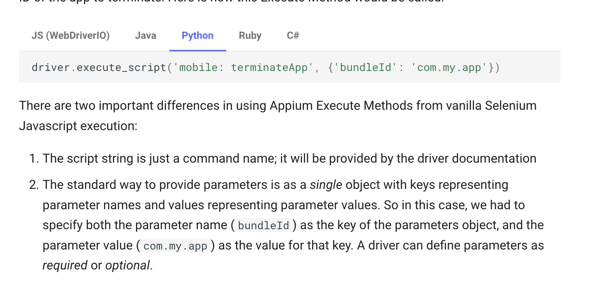

# Helpers

## iOS: Apple Bundle Official Bundle IDs
<https://support.apple.com/en-gb/guide/deployment/depece748c41/web>

## Execute Script
<https://appium.io/docs/en/2.0/guides/execute-methods/>, NOTE scroll down to the mobile examples for formatting info.



If you send the wrong mobile command or wrong args with the command you should get back a details list of options like so

```
UnknownCommandError: Unknown mobile command "pressButton". Only shell,execEmuConsoleCommand,dragGesture,flingGesture,doubleClickGesture,longClickGesture,pinchCloseGesture,pinchOpenGesture,swipeGesture,scrollGesture,scrollBackTo,scroll,viewportScreenshot,viewportRect,deepLink,startLogsBroadcast,stopLogsBroadcast,acceptAlert,dismissAlert,batteryInfo,deviceInfo,getDeviceTime,changePermissions,getPermissions,performEditorAction,startScreenStreaming,stopScreenStreaming,getNotifications,listSms,type,sensorSet,deleteFile,clearApp,startActivity,startService,stopService,broadcast,getContexts,installMultipleApks,unlock commands are supported.
```

**Some Examples**

<https://github.com/search?q=repo%3Asaucelabs-training%2Fdemo-js+mobile%3A&type=code>

### Press the Home Button

```python
    driver.execute_script('mobile:pressButton', {'name': 'home'})
```

### Open Default Apps