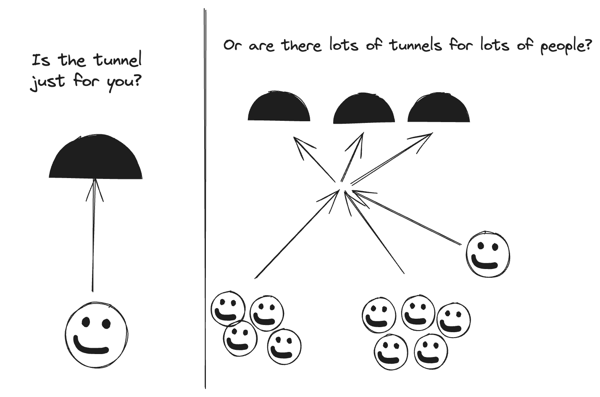

# Sauce Connect
TODO: Boilerplate links and helper section. Need links to latest versions and 

## Who is the tunnel for?
As usual complexity is easy, simplicity is hard. While Sauce Connect is incredibly flexible this can be a double edged sword as your use case will depend on multiple factors:
- team distribution
- team data segregation rules
- network access privileges
- risk management

To that end asking who will be using the tunnel, and which part of the network they'll be going to are critical.

If the user(s) are running ad hoc tunnels from their laptop that's a simple and straight forward use case. Easy to reason about, easy for users to self-serve, easy to debug. But this isn't the primary use case for Sauce Connect. 

Most users will have a complex list of (potentially) competing needs. CICD automation, managing instances of Sauce Connect, keeping variables unique where uniqueness is a constraint, shutting down tunnels in a timely manner, these all eat up time during the setup process if there's no accounting for flexibility each "instance" of Sauce Connect will require manual effort to maintain and adjust 

## Where will the tunnel go(in the network)
TODO pac files, proxies, flags flags flags

# TODO Gotchas
(windows & linux & mac)
security popup on mac

# TODO pre-flight check (windows & linux & mac)
