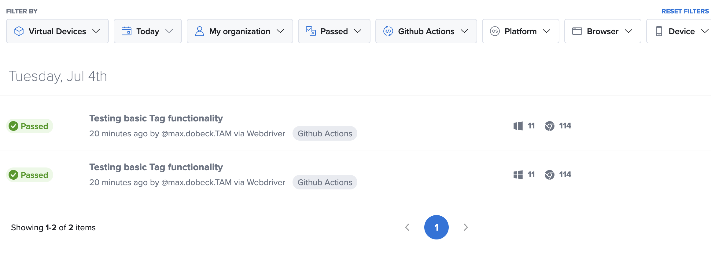
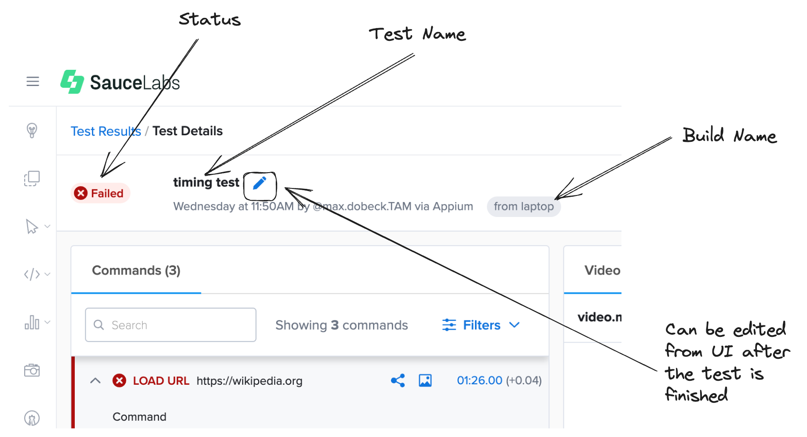
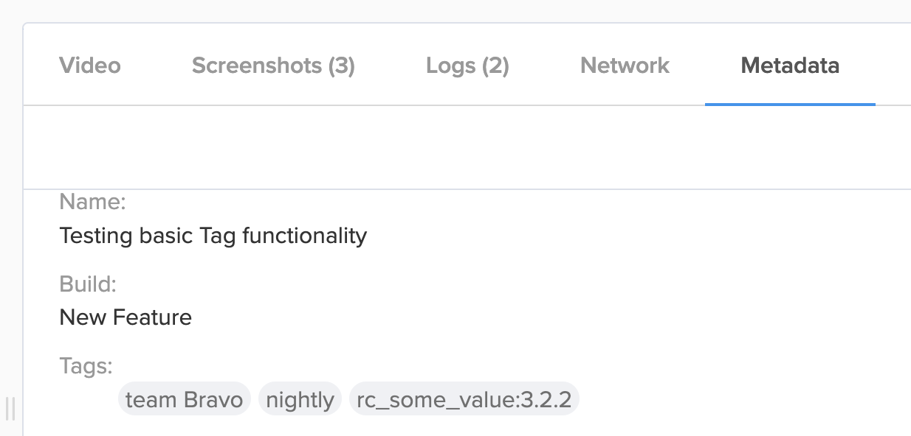

# Golden Path
Since all software is bespoke you may find yourself needing a specific way to save Key:Value pairs or information that acts as a Unique Identifier. 

For debugging information like the Status or [Context](https://docs.saucelabs.com/basics/test-config-annotation/test-annotation/#providing-context-for-selenium-or-appium-commands) messages are vital, but by grouping certain runs you can tell the end users things like:
- where the test ran
    - while debugging or developing this can be important information. Did the test run on the main pipeline? A specific agent? Populating these values at run time can be irreplaceable. 
- what kind of environment it ran in? (nightly, staging, release candidate X.Y.Z)
- what build of the software it ran on
- any version control information (git branch or PR for example)
- did the test/build/spec work or not? [Setting the Pass or Fail status](https://docs.saucelabs.com/basics/test-config-annotation/test-annotation/#setting-passfail) can happen after the test is complete or during execution.

## Anatomy of the Test Data
The useful data[^setting] for an end user is mainly comprised of these elements:
- Test Name
- Pass/Fail Status
- Build Name
- Tags

From the UI of the Sauce Session you can see all of these items and more, but the Insights pages let you explore your test suites in depth. How many different Test Names do you have? What is the Pass Rate or Fail rate as a percentage? From here you can drill down into failing tests or errors.

Or you can monitor performance of a Build or some other custom Tag you've set. 

[^setting]: Most of these items can be set at runtime or ahead of time (usually as an environment variable). Some can even be changed afterwards via the REST API or UI!

### Metadata
Inside the metadata of each session on Sauce Labs 

